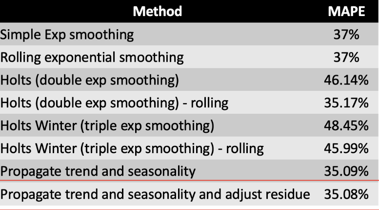

# Forecasting for Favoritas grocery stores

## Introduction
We aim to develop a sales forecasting model for a grocery store that
leverages historical sales data, external factors such as weather, and other relevant
variables. Our goal is to provide the grocery store with accurate predictions of future
sales to help them make informed decisions about inventory management, staffing, and
promotions.
To achieve this objective, we will use machine learning algorithms and data analysis
techniques to analyze the available data and identify patterns and trends. We will also
evaluate the performance of the model and fine-tune it to improve its accuracy.
By providing an accurate sales forecasting model, this project aims to help the grocery
store optimize its operations, reduce waste, and increase profitability. Ultimately, this
project can serve as a valuable tool for any grocery store looking to improve their sales
forecasting capabilities and make data-driven decisions.

## Data
All data can be found on Kaggle:
https://www.kaggle.com/competitions/favorita-grocery-sales-forecasting/data

## Methodology

We cover the following points in this projects which can be found within the Notebook:
1. Data Exploration - EDA of the data involving sales trends over years, time series analysis over stores and product families as well as external prices such as promotion, holiday effect or oil prices. 
2. Time Series Decomposition - Decomposing Trend, Seasonality and residuals of the Time series 
3. Forecasting approaches - The following methods were used for performing forecasting and the results were compared using MAPE: 
- Rolling exponential smoothing: This method applies a simple exponential
smoothing model to a rolling window of historical data to make short-term
predictions. This approach allows for changes in the data pattern over time to be
captured and used in the forecasting model.
- Holt's (double exponential smoothing): This method extends simple exponential
smoothing to capture trends in the data. It uses two smoothing parameters, one
for the level of the series and another for the trend component. This model can
be useful when the data exhibits a trend that is not seasonal.
- Holt's (double exponential smoothing) - rolling: This is a variant of Holt's model
that applies a rolling window to the historical data. By using a rolling window, the
model can capture changes in the trend over time and make short-term forecasts.
- Holt's Winter (triple exponential smoothing): This method extends Holt's model
to include seasonal components in the data. It uses three smoothing parameters,
one for the level of the series, one for the trend component, and another for the
seasonal component. This model is useful when the data exhibits both trend and
seasonal patterns.
- Holt's Winter (triple exponential smoothing) - rolling: This is a variant of the
Holt's Winter model that applies a rolling window to the historical data. By using a
rolling window, the model can capture changes in the trend and seasonal patterns
over time and make short-term forecasts.
- Propagate trend and seasonality: This method uses a linear regression model to
estimate the trend and seasonal components of the time series. The estimated
components are then used to make forecasts. This model can be useful when the
data exhibits a strong trend and seasonal patterns.
- Propagate trend and seasonality and adjust residue: This method extends the
previous model to also include an adjustment for the residual component of the
time series. This adjustment can help improve the accuracy of the forecasts by
accounting for any unusual or unexpected changes in the data that are not
captured by the trend and seasonal components.

## Results
Here are the Results that we obtained after our modeling

